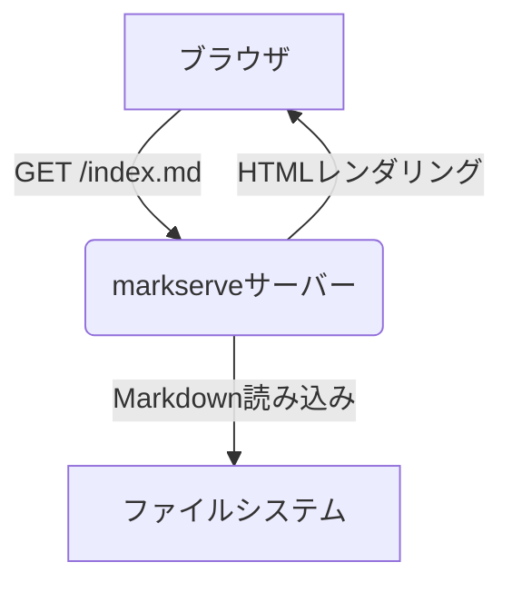

# Mermaid図のサンプル



# Vega-Liteグラフのサンプル

```vega-lite
{
  "$schema": "https://vega.github.io/schema/vega-lite/v5.json",
  "description": "サンプルの棒グラフ",
  "data": {
    "values": [
      {"category": "A", "value": 28},
      {"category": "B", "value": 55},
      {"category": "C", "value": 43}
    ]
  },
  "mark": "bar",
  "encoding": {
    "x": {"field": "category", "type": "nominal"},
    "y": {"field": "value", "type": "quantitative"}
  }
}
```

# 画像のサンプル

クリックすると別タブで拡大表示できます。


[トップへ戻る](index.md)
